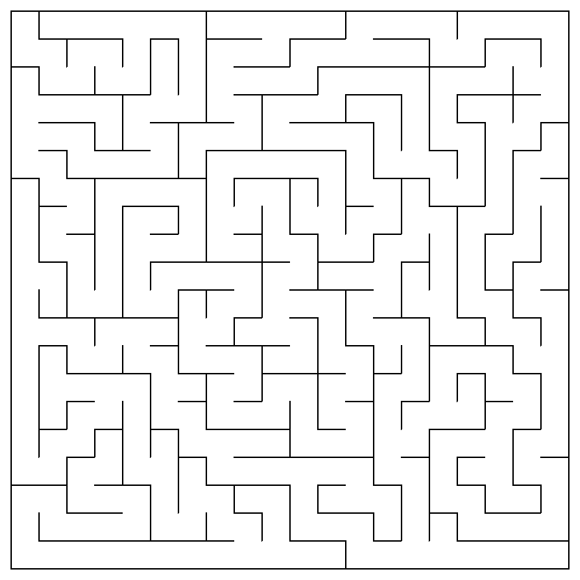

# Maze Generation Using Depth-First Search

Simple pseudocode for DFS-based maze generation I used to create a maze generation script.

```python-repl
function DFS(cell):
    mark cell as visited
    while cell has unvisited neighbors:
        choose a random unvisited neighbor
        remove the wall between cell and neighbor
        DFS(neighbor)
```

## **How to Run the Maze Generation Script**

1. **Python** : Ensure you have Python installed.
2. **PyQt5** : Install the PyQt5 library using pip. Open your terminal and run:

```bash
pip install PyQt5
```

3. **Run the Script** : Open your terminal and navigate to the directory where your [`maze.py`](vscode-file://vscode-app/Applications/Visual%20Studio%20Code.app/Contents/Resources/app/out/vs/code/electron-sandbox/workbench/workbench.html "/Users/lasithmadhuka/Desktop/maze/maze.py") script is located and Execute the script using Python. Run:

```bash
python maze.py
```

4. Control the Maze Generation :

* **Up Arrow** : Decreases the speed of maze generation.
* **Down Arrow** : Increases the speed of maze generation.
* **F** : Finishes the maze instantly.
* **S** : Starts or stops the maze generation.
* **R** : Resets the maze.

## Generated Maze


